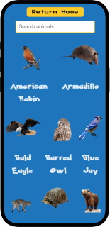
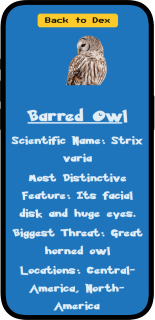
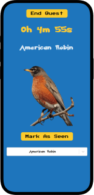

**CHECK IT OUT HERE:** [AnimalDex](https://camyacodes.github.io/Animaldex)

## ***Winner of AnimalHack 2024 out of 200+ participants***

## Description
**AnimalDex** is a real-life interpretation of a Pokédex, allowing users to discover and learn about dozens of real-life animals. From backyard creatures to animals spotted during nature hikes, users can explore what they look like and read fun facts to become animal experts. Additionally, the app offers a quest feature that challenges users to spot animals in real life, track their sightings, and earn points.

## User Story
**AS** a nature enthusiast or someone who enjoys outdoor adventures,  
**I WANT** to explore real-life animals, go on animal-spotting quests, and track the creatures I find,  
**SO THAT** I can learn more about the world around me and challenge myself to spot as many species as possible.

  
  
  

## Technologies Used

### Frontend:
- **React:** Building the user interface.
- **React Router DOM:** Routing and navigation within the app.
- **Vite:** Development server and build tool.

### Styling:
- **Bootstrap:** Responsive design and styling.
- **CSS:** Custom styling and layout adjustments.

### API Integration:
- **Axios:** Making HTTP requests to APIs.
- **AWS S3:** Storing and managing files.
- **Animals by API-Ninjas:** Providing animal data for the application.

### Email Support:
- **EmailJS:** Sending emails from the application.

### Version Control:
- **GitHub Pages:** Hosting and deploying the application.

### *** Check out the live site here: https://camyacodes.github.io/Animaldex/ ***
